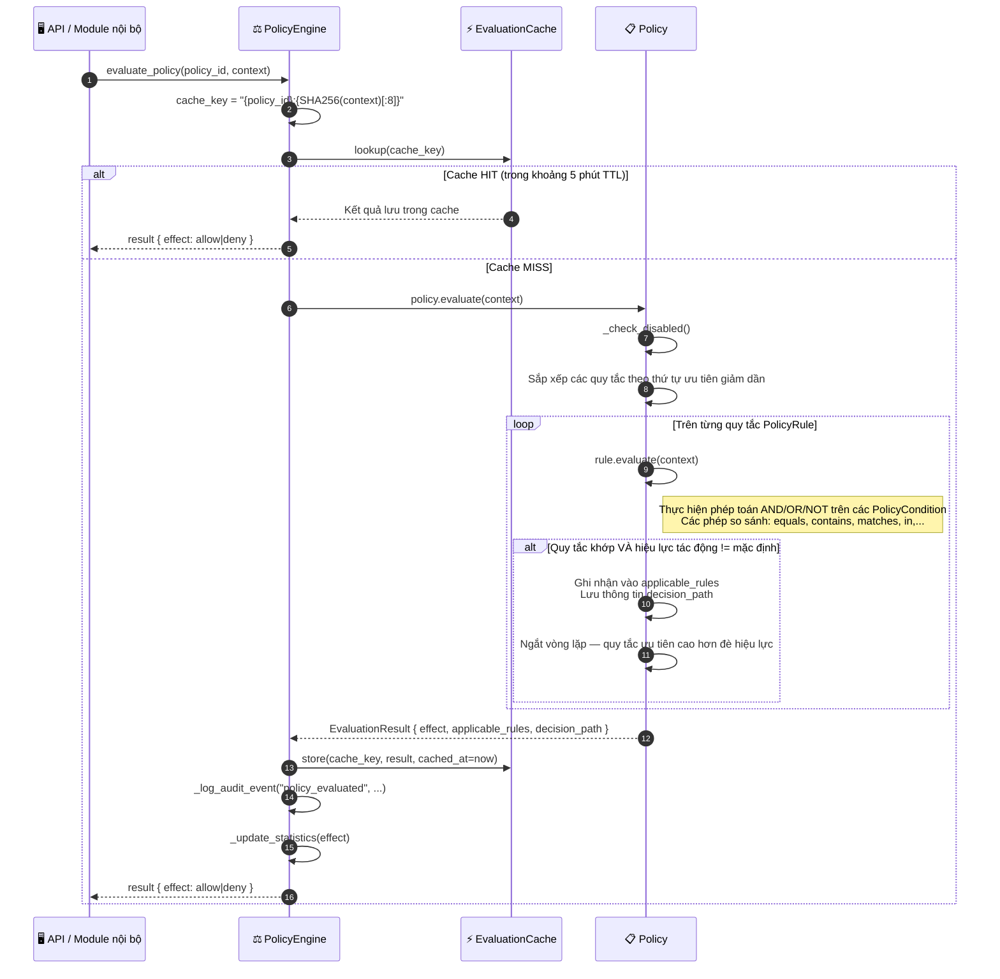

# Thực thi chính sách

## Tổng quan

Mọi thao tác nhạy cảm trong HieraChain đều qua `PolicyEngine`. Chính sách gồm nhóm `PolicyRule` sắp xếp theo ưu tiên. Để giảm độ trễ, kết quả đánh giá được cache (TTL 5 phút, LRU). Mọi kết quả đều được ghi vào log kiểm toán trong bộ nhớ.

`PolicyEngine` là cổng ủy quyền duy nhất. Nó được MSP gọi sau khi xác minh danh tính và ngay trước khi gọi `SubChain.add_event()`.

---

## Biểu đồ luồng



---

## Cấu trúc quy tắc chính sách

```python
# Ví dụ: chỉ cho phép operator hợp lệ gửi sự kiện
policy = Policy(
    policy_id="event_submission_policy",
    name="Event Submission Access",
    effect=PolicyEffect.DENY,       # hiệu lực mặc định nếu không có quy tắc nào khớp
    rules=[
        PolicyRule(
            rule_id="allow_operators",
            priority=100,
            effect=PolicyEffect.ALLOW,
            conditions=[
                PolicyCondition(field="role", operator="in", value=["admin", "operator"])
            ],
            logic=RuleLogic.AND
        )
    ]
)
```

---

## Các bước chi tiết

| Bước | Mô tả |
|:-----|:------|
| **1. Kiểm tra cache** | Tạo khóa `cache_key = "{policy_id}:{SHA256(context)[:8]}"`. Nếu hit và TTL hợp lệ thì trả về ngay. |
| **2. Sắp xếp quy tắc** | Sắp xếp theo `priority` giảm dần (ưu tiên cao đánh giá trước). |
| **3. Đánh giá quy tắc** | Mỗi quy tắc kiểm tra `PolicyCondition` theo logic AND/OR/NOT. |
| **4. Ghi đè đầu tiên** | Quy tắc khớp đầu tiên có effect khác mặc định sẽ thắng; các quy tắc còn lại bỏ qua. |
| **5. Lưu cache** | Lưu kết quả kèm `cached_at` để hết hạn sau 5 phút. |
| **6. Log kiểm toán**| Ghi `policy_id`, `context`, `effect` và `decision_path` vào log kiểm toán. |

---

## Phép so sánh điều kiện

| Phép so sánh | Mô tả | Ví dụ |
|:-------------|:------|:------|
| `equals` | Khớp tuyệt đối | `role == "admin"` |
| `not_equals` | Phủ định | `status != "revoked"` |
| `contains` | Tìm chuỗi hoặc phần tử trong danh sách | `permissions contains "submit_events"` |
| `matches` | Biểu thức chính quy | `entity_id matches "^product-.*"` |
| `in` | Thuộc tập hợp | `role in ["admin", "operator"]` |
| `greater_than` | So sánh lớn hơn | `risk_score > 0.8` |

---

## Xử lý lỗi

| Tình huống | Hành vi |
|:-----------|:--------|
| Không tìm thấy chính sách | Trả về `DENY` (fail-closed) |
| Chính sách bị tắt | Trả về ngay effect mặc định (không chạy quy tắc) |
| Context thiếu trường yêu cầu | Điều kiện trả về `False`; ghi log là khớp một phần |
| Cache bị giải phóng (LRU) | Request tiếp theo tính lại chính sách |

---

## Lớp và phương thức chính

| Bước | Lớp / Phương thức | Tệp |
|:-----|:--------------|:-----|
| Điểm gọi chính | `PolicyEngine.evaluate_policy()` | `security/policy_engine.py` |
| Đánh giá đa chính sách | `PolicyEngine.evaluate_policy_set()` | `security/policy_engine.py` |
| Đánh giá quy tắc | `PolicyRule.evaluate()` | `security/policy_engine.py` |
| Kiểm tra điều kiện | `PolicyCondition.evaluate()` | `security/policy_engine.py` |
| Đọc cache | `_get_cached_result()` | `security/policy_engine.py` |
| Ghi cache | `_cache_result()` | `security/policy_engine.py` |

---

## Liên quan

- [Danh tính MSP](./msp-identity.md): MSP gọi `evaluate_policy()` sau khi xác minh danh tính
- [Gửi Sự kiện](./event-submission.md): `add_event()` được bảo vệ bởi engine chính sách
