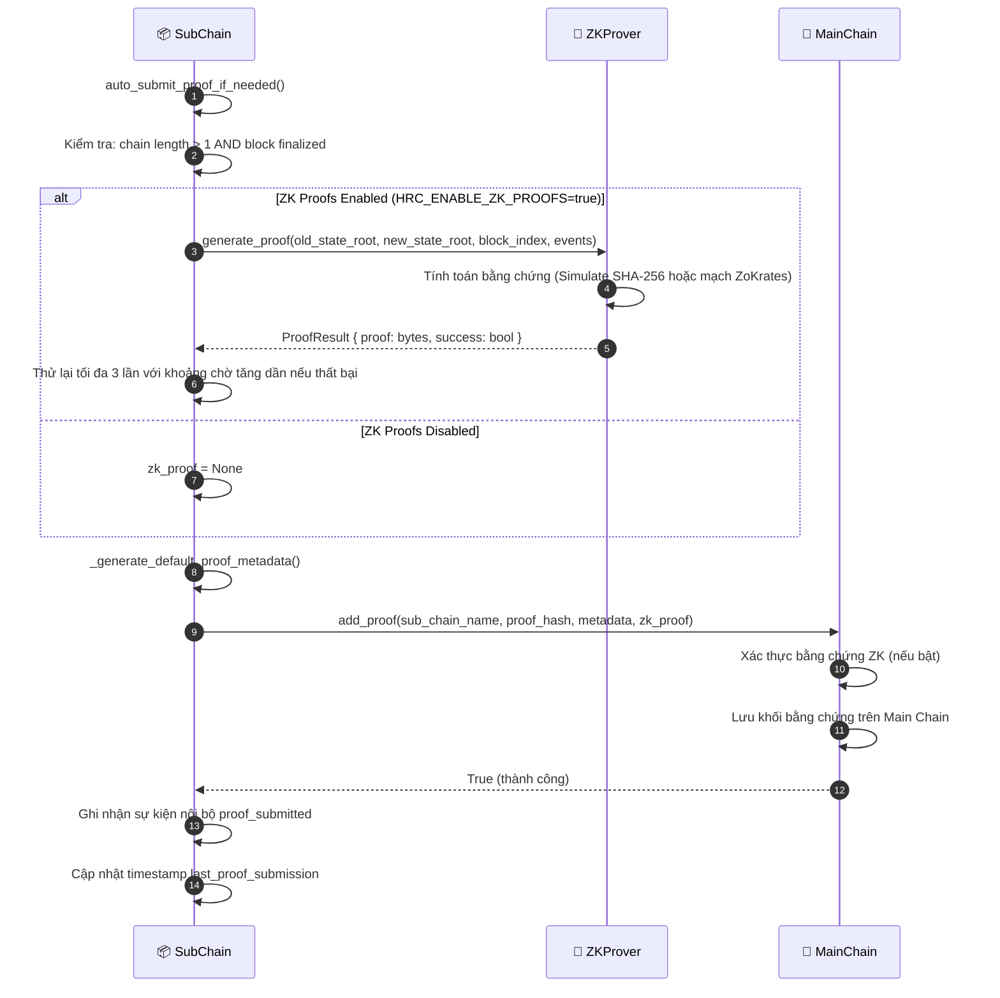

# Neo giữ bằng chứng

## Tổng quan

Sau khi khối hoàn tất trên Sub-Chain, Sub-Chain gửi bằng chứng mã hóa (hash và proof ZK tùy chọn) lên Main Chain. Main Chain chỉ lưu bằng chứng này, không lưu dữ liệu sự kiện thô. Cách này giữ tính bất biến toàn cục mà không lưu dữ liệu nhạy cảm trên chuỗi gốc.

Đây là trigger sau khối, không phải lệnh do người dùng gọi. Nó tự kích hoạt khi `chain_length % proof_interval == 0`.

---

## Biểu đồ luồng

---

## Các bước chi tiết

| Bước | Mô tả |
|:-----|:------|
| **1. Kiểm tra kích hoạt** | `auto_submit_proof_if_needed()` kiểm tra `len(chain) > 1` và khối đã hoàn tất. |
| **2. Tạo proof ZK** | Nếu `HRC_ENABLE_ZK_PROOFS=true`: ZKProver tính trên `(old_state_root, new_state_root, events)`. Thử lại tối đa 3 lần nếu lỗi. |
| **3. Metadata proof** | `_generate_default_proof_metadata()` tạo `{ sub_chain_name, block_count, latest_hash, timestamp }`. |
| **4. Ghi lên Main Chain** | `MainChain.add_proof()` xác thực proof ZK, rồi nối khối proof mới vào Main Chain. |
| **5. Ghi nhận** | Sub-Chain ghi log sự kiện nội bộ `proof_submitted` và cập nhật `last_proof_submission`. |

---

## Chế độ proof ZK

| Chế độ | Cơ chế | Trường hợp dùng |
|:-------|:-------|:-------------------|
| `mock` | Mô phỏng băm SHA-256 | Phát triển / kiểm thử |
| `production` | Mạch ZoKrates ZK-SNARKs | Triển khai thực tế |

---

## Cấu hình

| Cài đặt | Mặc định | Mô tả |
|:--------|:---------|:------|
| `HRC_ENABLE_ZK_PROOFS` | `false` | Bật/tắt xác thực ZK |
| `HRC_ZK_MODE` | `mock` | `mock` hoặc `production` |
| `HRC_ZK_REQUIRED_MAINCHAIN` | `false` | Chặn gửi proof lên Main Chain nếu ZK lỗi |

---

## Xử lý lỗi

| Tình huống | Hành vi |
|:-----------|:--------|
| Lỗi tạo proof ZK | Thử lại tối đa 3 lần với chờ tăng dần; nếu `HRC_ZK_REQUIRED_MAINCHAIN=true` thì hủy |
| Ghi lên Main Chain lỗi | Ghi log exception, không cập nhật `last_proof_submission`; thử lại ở khối tiếp theo |
| Xác thực ZK trên Main Chain lỗi | `add_proof()` ném exception, khối proof không được nối |

---

## Lớp và phương thức chính

| Bước | Lớp / Phương thức | Tệp |
|:-----|:--------------|:-----|
| Kích hoạt | `SubChain.auto_submit_proof_if_needed()` | `hierarchical/sub_chain/base.py` |
| Tạo ZK | `ZKProver.generate_proof()` | `security/zk_prover.py` |
| Metadata proof | `_generate_default_proof_metadata()` | `hierarchical/sub_chain/base.py` |
| Neo lên Main | `MainChain.add_proof()` | `hierarchical/main_chain/base.py` |
| Xác thực ZK | `ZKVerifier.verify_proof()` | `security/verify/zk_verifier.py` |

---

## Liên quan

- [Gửi Sự kiện](./event-submission.md): luồng kích hoạt quy trình này
- [Xác thực Tính toàn vẹn](./integrity-validation.md): kiểm tra nhất quán proof giữa Sub-Chain và Main Chain
