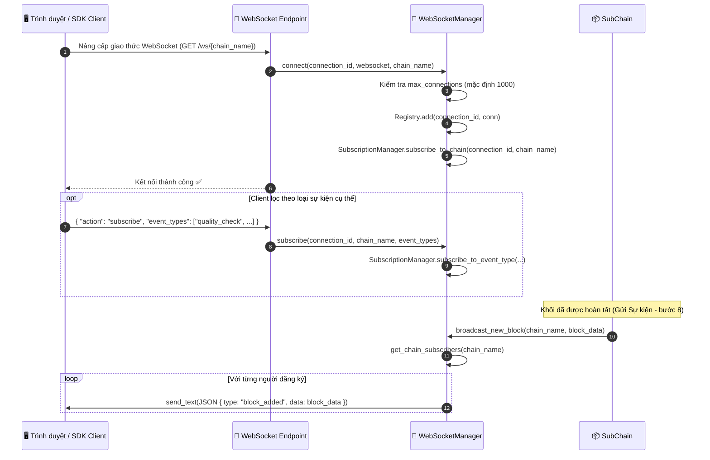
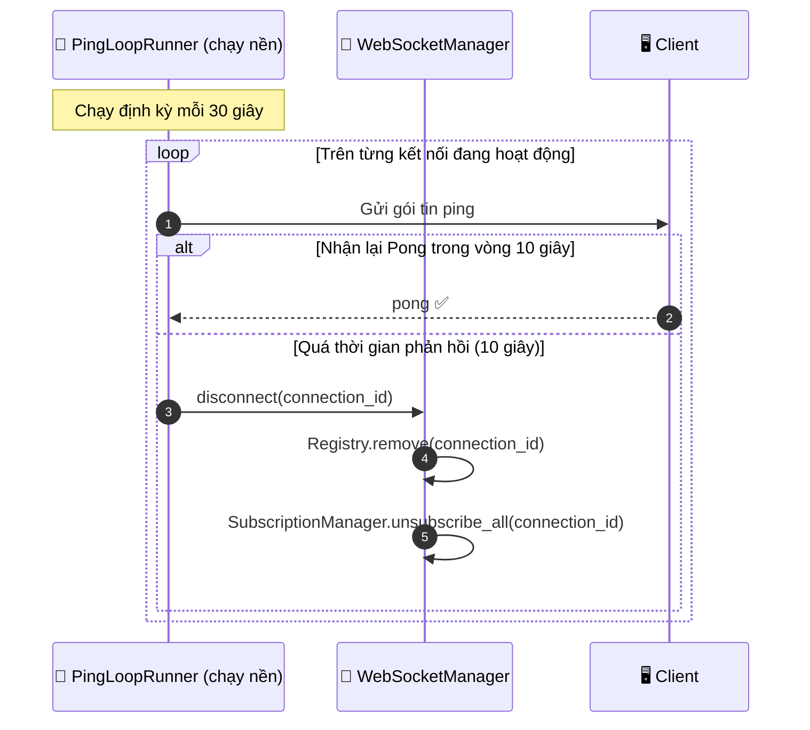

# Luồng dữ liệu WebSocket thời gian thực

## Tổng quan

HieraChain đẩy thông báo khối mới và sự kiện mới tới client đang kết nối qua WebSocket. Client có thể đăng ký theo chuỗi cụ thể hoặc theo loại sự kiện. Vòng lặp ping nền giám sát kết nối chết và tự giải phóng.

`WebSocketManager` là singleton (`ws_manager`) dùng chung cho mọi route API để quản lý đăng ký tập trung.

---

## Biểu đồ luồng: vòng đời kết nối và broadcast



---

## Biểu đồ luồng: vòng lặp ping và dọn dẹp



---

## Định dạng thông điệp

```json
// Thông báo khi có khối mới
{
    "type": "block_added",
    "chain": "supply_chain",
    "data": {
        "index": 42,
        "hash": "a3f8b2c1...",
        "previous_hash": "9d1e4f...",
        "timestamp": 1714000000.0,
        "event_count": 5
    }
}

// Thông báo sự kiện (nếu đăng ký lọc theo event_types)
{
    "type": "event",
    "chain": "supply_chain",
    "event_type": "quality_check",
    "data": {
        "entity_id": "product-SKU-001",
        "event": "quality_check",
        "details": { "result": "passed" }
    }
}
```

---

## Các bước chi tiết

| Bước | Mô tả |
|:-----|:------|
| **1. Nâng cấp giao thức** | Gửi HTTP GET kèm header `Upgrade: websocket`. |
| **2. Kiểm tra giới hạn** | Từ chối nếu `active_connections >= max_connections` (mặc định 1000). |
| **3. Đăng ký** | `ConnectionRegistry.add()` lưu kết nối theo `connection_id`. |
| **4. Đăng ký chuỗi** | `SubscriptionManager.subscribe_to_chain()` liên kết kết nối với chuỗi. |
| **5. Bộ lọc tùy chọn** | Client có thể gửi danh sách `event_types` để lọc. |
| **6. Broadcast** | Khi Gửi Sự kiện hoàn tất khối mới, `broadcast_new_block()` gửi tới mọi subscriber. |
| **7. Vòng lặp ping** | Luồng nền gửi ping mỗi 30 giây; ngắt client không phản hồi quá 10 giây. |

---

## Xử lý lỗi

| Tình huống | Hành vi |
|:-----------|:--------|
| Vượt giới hạn kết nối | Từ chối kèm mã `1008 Policy Violation` |
| Client ngắt đột ngột | `ConnectionRegistry.remove()` được gọi ở lần gửi lỗi tiếp theo |
| Gửi lỗi do kết nối hỏng | Bắt exception, gọi `disconnect()`, xóa khỏi Registry |
| Broadcast khi không có subscriber | Bỏ qua (No-op), không lỗi |

---

## Lớp và phương thức chính

| Bước | Lớp / Phương thức | Tệp |
|:-----|:--------------|:-----|
| Singleton | `ws_manager` | `api/websocket/manager.py` |
| Tạo kết nối | `WebSocketManager.connect()` | `api/websocket/manager.py` |
| Ngắt kết nối | `WebSocketManager.disconnect()` | `api/websocket/manager.py` |
| Đăng ký | `WebSocketManager.subscribe()` | `api/websocket/manager.py` |
| Phát khối mới | `WebSocketManager.broadcast_new_block()` | `api/websocket/manager.py` |
| Phát sự kiện mới | `WebSocketManager.broadcast_event()` | `api/websocket/manager.py` |
| Vòng lặp ping | `PingLoopRunner` | `api/websocket/handlers.py` |
| Xây dựng thông điệp | `build_block_added()` / `build_event_message()` | `api/websocket/builders.py` |
| Kho kết nối | `ConnectionRegistry` | `api/websocket/registry.py` |

---

## Liên quan

- [Gửi Sự kiện](./event-submission.md): kích hoạt `broadcast_new_block()` sau khi commit khối
- [Cảnh báo Rủi ro](./risk-alerts.md): cảnh báo cũng được đẩy qua kênh WebSocket này
